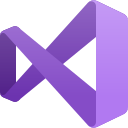

# spydir

  
  
  
  

---

  
  
  

## Languages & Technologies

  
  
  
  
  
  
  
  
  
  

  
  

<strong>Reverse Engineering &bull; Security Research &bull; High-Level Development</strong>

